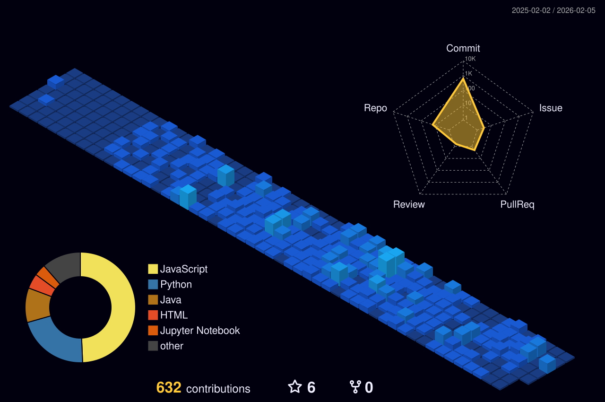

<div align="center">

<!--  -->


<br/>

[](https://git.io/typing-svg)

<br/>


<p align="center">
  <a href="https://github.com/Dhinakaran311">
    
  </a>
  <a href="https://github.com/Dhinakaran311?tab=followers">
    
  </a>
  <a href="https://github.com/Dhinakaran311?tab=repositories">
    
  </a>
</p>


</div>

---

##  Developer Profile Overview

```python
class DhinakaranMS:
    def __init__(self):
        self.name = "Dhinakaran M S"
        self.role = "AI/ML Engineer & Full-Stack Developer"
        self.location = "India 🇮🇳"
        self.education = "B.E. CSE (Specialization in AI & ML)"
        self.passion = ["Problem Solving", "Building AI Solutions", "Web Development"]
        
    def current_focus(self):
        return [
            "🔬 Deep Learning & Neural Networks",
            "🌐 Building scalable web applications",
            "💪 Mastering competitive programming",
            "🚀 Contributing to open source"
        ]
    
    def get_daily_routine(self):
        return "Code 💻 → Solve Problems 🧩 → Learn 📚 → Repeat 🔄"
```

---

##  Tech Arsenal

<details open>
<summary><b> Languages</b></summary>
<br/>


</details>

<details open>
<summary><b> Frontend Development</b></summary>
<br/>


</details>

<details open>
<summary><b> Backend & Database</b></summary>
<br/>


</details>

<details open>
<summary><b>AI/ML & Data Science</b></summary>
<br/>


</details>

---

<div align="center">

# Competitive Programming Stats

<table>
<tr>
<td width="50%" valign="top">

### 📊 LeetCode Profile

<a href="https://leetcode.com/u/Dhinakaran311/">
  
</a>
<a href="https://leetcode.com/u/Dhinakaran311/" target="_blank">
    
  </a>
</td>

<td width="50%" valign="top">

###  CodeChef Profile

<table align="center">
  <tr>
    <td align="center" colspan="2">
      
    </td>
  </tr>
  <tr>
    <td align="center">
      
    </td>
    <td align="center">
      
    </td>
  </tr>
  <tr>
    <td align="center">
      
    </td>
    <td align="center">
      
    </td>
  </tr>
  <tr>
    <td align="center" colspan="2">
      
    </td>
  </tr>
  
</table>
<a href="https://www.codechef.com/users/dhinakaran311" target="_blank">
    
  </a>


<br/>

**Achievements**
-  627 Problems Solved
-  Peak Rating: 1513
-  80 Contests Participated
-  200+ Active Days

</td>
</tr>
</table>

---

<span style="font-size:16px;">Keep coding, keep growing! 💻</span>


</div>


## Showcasing My Best Work

<table>
<tr>
<td width="50%">

### 💰 Expense Tracker
[](https://github.com/Dhinakaran311/Expense_tracker)

**🔹 Track your expenses effortlessly**  
A comprehensive expense tracking application with intuitive UI and powerful analytics.

</td>
<td width="50%">

### 🍕 Food Delivery Time Prediction
[](https://github.com/Dhinakaran311/FOOD_DELIVERY_TIME_PREDICTION)

**🔹 ML-powered delivery estimation**  
Predict food delivery times using machine learning algorithms.

</td>
</tr>

<tr>
<td width="50%">

### ✅ Todo Application
[](https://github.com/Dhinakaran311/TodoApp)

**🔹 Stay organized and productive**  
Modern todo app with a clean interface and essential features.

</td>
<td width="50%">

### 💼 Job Search Platform
[](https://github.com/Dhinakaran311/Job_Search)

**🔹 Find your dream job**  
Comprehensive job search application with advanced filtering.

</td>
</tr>

<tr>
<td width="50%">

### 🌐 Personal Portfolio
[](https://github.com/Dhinakaran311/Portfolio_DK)

**🔹 Showcasing my journey**  
Professional portfolio website highlighting my skills and projects.

</td>
<td width="50%">

### 🎂 Age Calculator
[](https://github.com/Dhinakaran311/Age-Calculator)

**🔹 Calculate age precisely**  
Simple yet elegant age calculator with detailed breakdowns.

</td>
</tr>
</table>

<div align="center">

### 🌟 More Projects Coming Soon!

[](https://github.com/Dhinakaran311?tab=repositories)

</div>

---


## 📊 GitHub Analytics

<div align="center">
  
  

</div>


<br/>
</div>
<p align="center">
<div align="center">

<a href="https://github.com/Dhinakaran311"> 
 
<br/><br/>


  
<br/><br/>
</a>

<a href="https://github.com/Dhinakaran311"> 



</a>

<br/><br/>

[](https://github.com/Dhinakaran311)

<br/>

[](https://github.com/Dhinakaran311)

<br/><br/>


</div>
</p>


---

##  Contribution Snake

<div align="center">
  <picture>
    <source media="(prefers-color-scheme: dark)" srcset="https://raw.githubusercontent.com/Dhinakaran311/dhinakaran311/output/github-snake-dark.svg" />
    <source media="(prefers-color-scheme: light)" srcset="https://raw.githubusercontent.com/Dhinakaran311/dhinakaran311/output/github-snake.svg" />
    
  </picture>
</div>

---


##  Connect With Me

<div align="center">


[](https://www.linkedin.com/in/dhinakaran-ms-934296378/)
[](mailto:dhinakaranms123@gmail.com)
[](https://codolio.com/profile/Dhinakaran311)

</div>

---

<div align="center">

### 💭 Quote of the Day


<br/><br/>
### 💡 Today's Random Dev Joke


<br/><br/>
<hr>

### ✨ "Code is poetry written in logic"


**⭐ If you find my work interesting, feel free to star my repositories!**

*Made with ❤️ by [Dhinakaran M S](https://github.com/Dhinakaran311)*


